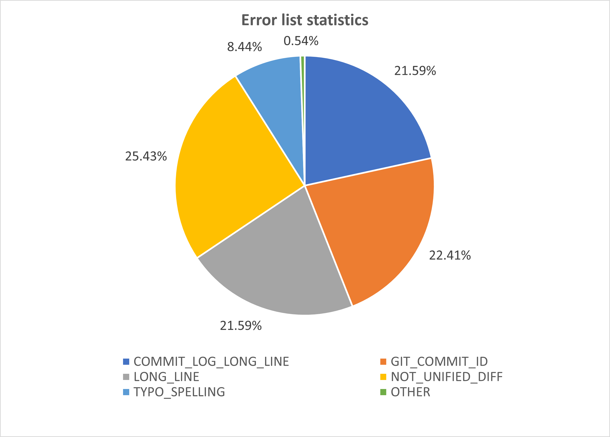

# List of all non-merge commits
```
git rev-list --no-merges HEAD > ./no-merge.txt
```
### Run checkpatch.pl by each non-merge commit
There is a sample [`run-checkpatch2.sh`](run-checkpatch2.sh) file that uses to run checkpatch.pl by each commit

# Error list of all commits
- Use [run-checkpatch2.sh](run-checkpatch2.sh) to run through all commits and show the type of error
- All reports are saved in [final-result](final-result.txt)
# Statistics
- All types of error are listed in [statistics.txt](result/statistics.txt)
- All types without any error are listed in [without-error.txt](result/without-error.txt)
- 
